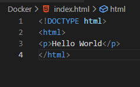
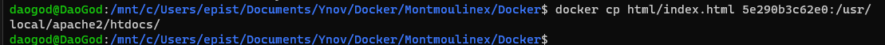
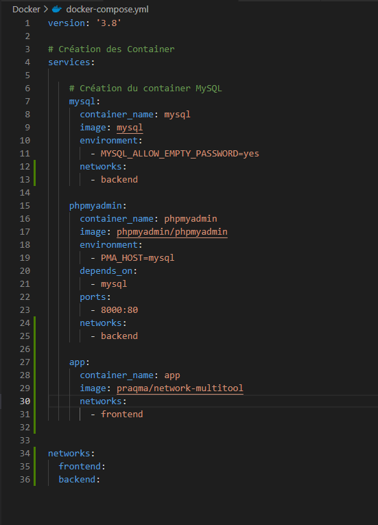

# TP Docker 

## Sujet

Pour le sujet de ce TP, aller à ce lien : https://github.com/DaoGod/Docker/tree/main/Sujet

## 1. Quelques commandes à tester

● **docker run hello-world**
Hello-world d’exemple avec Docker

● **docker run -it ubuntu bash**
Création d’un conteneur et utilisation d’un bash en interactif exit ou Ctrl+D - Pour sortir du conteneur

● **docker images**
Afficher les images Docker disponibles en local

● **docker ps -a**
Affiche tous les conteneurs (en exécution ou pas, grâce à l’option -a)

● **docker run -p 80:80 nginx et docker run -p -d 80:80 nginx**
Démarre un serveur web disponible sur votre navigateur à l’adresse localhost:80

## 2. Début du TP

Initialiser un nouveau repository git qui vous permettra de sauvegarder les fichiers créés pendant le TP. Vous enverrez un zip du repository à la fin du TP avec vos réponses aux questions / exécutions et résultats sur la console dans des fichiers texte (Markdown par exemple) par e-mail.
Utilisez git progressivement ! (Ne pas faire qu’un seul commit à la fin)

## 3. Exécuter un serveur web (apache, nginx, …) dans un conteneur docker

### a. Récupérer l’image sur le Docker Hub

Commande : 

### b. Vérifier que cette image est présente en local

Commande : 

docker images

Resultat : 

### c. Créer un fichier index.html simple

### d. Démarrer un conteneur et servir la page html créée précédemment à l’aide d’un volume (option -v de docker run)

### e. Supprimer le conteneur précédent et arriver au même résultat que précédemment à l’aide de la commande docker cp

## 4. Builder une image

### a. A l’aide d’un Dockerfile, créer une image (commande docker build)

### b. Exécuter cette nouvelle image de manière à servir la page html (commande docker run)

### c. Quelles différences observez-vous entre les procédures 5. et 6. ? Avantages et inconvénients de l’une et de l’autre méthode ? (Mettre en relation ce qui est observé avec ce qui a été présenté pendant le cours)

Les différences sont multiples, tout d'abord, la création d'un conteneur avec un Dockerfile est plus simple et plus structuré. Ensuite, elle permet de créer facilement plusieurs conteneurs à la suite. Chaque conteneur aura la même base.

Cependant, cette méthode prends plus de temps que celle de la procédure 5.

Pour la procédure 5, c'est une méthode simple et rapide à utiiliser mais qui peut comporter des erreurs et donc qui peut prendre du temps.

## Utiliser une base de données dans un conteneur docker

### a. Récupérer les images mysql:5.7 et phpmyadmin/phpmyadmin depuis le Docker Hub

### b. Exécuter deux conteneurs à partir des images et ajouter une table ainsi que quelques enregistrements dans la base de données à l’aide de phpmyadmin

Je spécifie l'id de l'image car si je mets le nom de l'image, ça va me re-pull la dernière image existante dans le docker hub.

Je spécifie l'id de l'image car si je mets le nom de l'image, ça va me re-pull la dernière image existante dans le docker hub.

## Faire la même chose que précédemment en utilisant un fichier docker-compose.yml
### a. Qu’apporte le fichier docker-compose par rapport aux commandes docker run ? Pourquoi est-il intéressant ? (cf. ce qui a été présenté pendant le cours)

Ce qu'apporte un docker-compose est plus de simplicité et de structure. Tout d'abord, un docker-compose permet de créer autant de conteneur docker qu'on veut. Il permet aussi de spécifié comment structuré ton conteneur de la façon que tu veux.

Comparer au commande qu'il faut déjà connaitre, alors que le docker compose il y a une seule ligne de commande pour pull l'image et créer les conteneurs.

Démarer les containers : docker-compose up -d
Arrêter les containers : docker-compose stop
Pour supprimer tous ce qui a été crééé : docker-compose down

### b. Quel moyen permet de configurer (premier utilisateur, première base de données, mot de passe root, …) facilement le conteneur mysql au lancement ?

Le moyen qui permet de configurer plusieurs paramètre au lancement du conteneur mysql est le **-e**. Ceci permet de définir les **variables d'environnement**.

ex: -e MYSQL_ALLOW_EMPTY_PASSWORD=yes

## Observation de l’isolation réseau entre 3 conteneurs
### a. A l’aide de docker-compose et de l’image praqma/network-multitool disponible sur le Docker Hub créer 3 services (web, app et db) et 2 réseaux (frontend et backend). Les services web et db ne devront pas pouvoir effectuer de ping de l’un vers l’autre

J'ai créer un conteneur debian qui est dans le même réseau que celui de app pour vérifier que le ping marche bien dans son propre réseau.

docker exec -it tp1_docker sh
Commande pour ping un autre container : ping debian

### b. Quelles lignes du résultat de la commande docker inspect justifient ce comportement ?

Les lignes de la commande **docker inspect** qui permmettent de justifier ce comportement sont les lignes du **NetworkSettings** :

### c. Dans quelle situation réelles (avec quelles images) pourrait-on avoir cette configuration réseau ? Dans quel but ?

Un exemple de situation réelles où l'on pouurait avoir cette configuration réseau serai lors de l'exécution d'une application Web. Dans ce cas, les conteneurs qui font partie de l'application, tels que le serveur Web et la base de données, peuvent être placés dans un réseau privé pour une communication sécurisée. En même temps, un autre réseau pourrait être créé pour les conteneurs de surveillance tels que les conteneurs de surveillance de performances. 

Dans ce contexte, les images utilisées pour les conteneurs peuvent varier en fonction des besoins de l'application. Par exemple, l'image MySQL peut être utilisée pour la base de données et l'image NGINX pour le serveur Web.